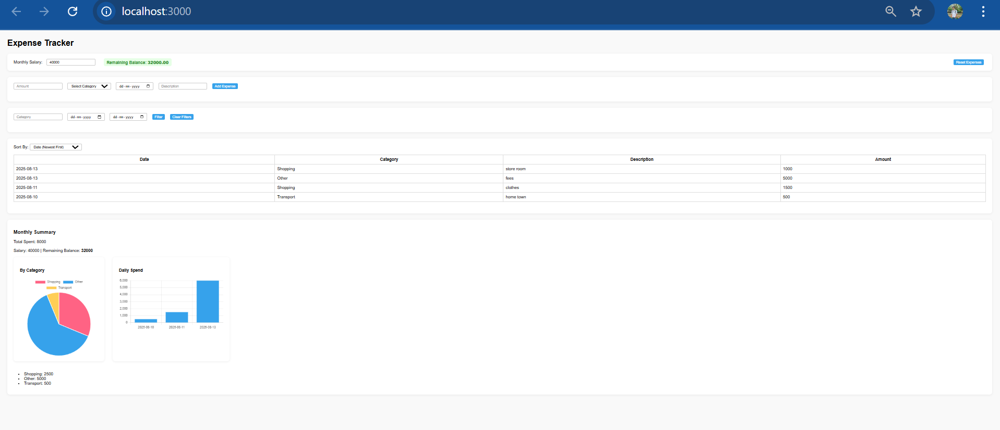

💰 Expense Tracker

# 💰 Expense Tracker  
  
  
  
  

A full-stack expense tracking application built with React (Frontend) and Spring Boot (Backend). This app helps users manage their income and expenses efficiently, providing insights and warnings when expenses exceed income.

📌 Features

Add, update, and delete expenses
Track income vs expenses
Monthly expense summaries
Alerts when expenses exceed income
User-friendly interface

🛠 Tech Stack

Frontend: React, JavaScript, CSS
Backend: Java Spring Boot
Database: MySQL
Tools: Maven, npm

📂 Project Structure
Expense-Tracker/
├── backend/        # Spring Boot API
├── frontend/       # React application
└── README.md       # Project documentation

⚡ Getting Started

✅ Prerequisites

Node.js
Java 17+
MySQL

🔹 Clone the Repository
git clone https://github.com/PrajwalVithale/Expense-Tracker.git
cd Expense-Tracker

🔹 Frontend Setup
cd frontend
npm install
npm start

🔹 Backend Setup
cd ../backend
./mvnw spring-boot:run

⚡ Database Setup

Install MySQL and create a database:
CREATE DATABASE expense_tracker;

Configure application.properties in:
backend/src/main/resources/application.properties

Example configuration:

spring.datasource.url=jdbc:mysql://localhost:3306/expense_tracker
spring.datasource.username=root
spring.datasource.password=2003
spring.jpa.hibernate.ddl-auto=update

✅ Run the Project

Start backend first (Spring Boot)
Start frontend (React)
Open browser at:
http://localhost:3000

📸 Screenshots  

📜 License

This project is open-source and available under the MIT License.

✅ After adding this file, run the following commands in PowerShell from the Expense-Tracker root:

git add README.md
git commit -m "Added README with setup instructions"
git push